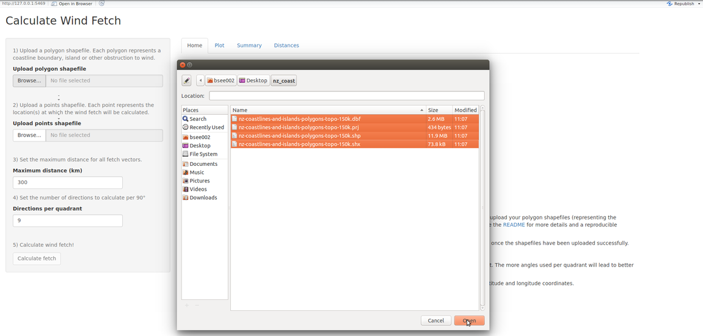
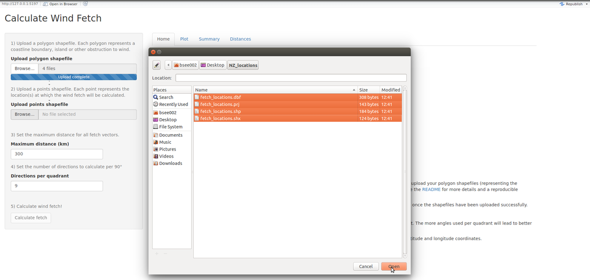

## Wind fetch

Wind fetch is an important measurement in coastal applications. It
provides a measurement for the unobstructed length of water over which
wind from a certain direction can blow over. The higher the wind fetch
from a certain direction, the more energy is imparted onto the surface
of the water resulting in a larger sea state. Therefore, the larger the
fetch, the larger the exposure to wind and the more likely the site
experiences larger sea states.

## Simplifying fetch calculations

Averaging the wind fetch for numerous directions at the same location is
a reasonable measure of the overall wind exposure. This process of
calculating wind fetch can be extremely time-consuming and tedious,
particularly if a large number of fetch vectors are required at many
locations. The [**windfetch**](https://github.com/blasee/windfetch)
package is designed to calculate fetch lengths at locations anywhere on
Earth, using **R**. This application uses the **windfetch** package but
allows users to calculate fetch *without* **R**.

## How to use this application

This [**windfetch**](https://github.com/blasee/windfetch) application
requires two shapefiles; one for the coastlines and other boundaries,
and one for the locations at which to calculate wind fetch. The
following example details the steps required for calculating fetch with
a reproducible example using data from the [Land Information New Zealand
(LINZ) Data Service](https://data.linz.govt.nz/)[1].

### 1) Upload a polygon shapefile to the application

This shapefile must:

-   be a Polygons ESRI shapefile, and;
-   have a valid map projection

As an example, download the [high resolution New Zealand coastlines and
islands polygons
shapefile](https://data.linz.govt.nz/layer/1153-nz-coastlines-and-islands-polygons-topo-150k/)
as a GIS shapefile with the NZGD2000 / New Zealand Transverse Mercator
2000 (EPSG:2193) map projection. Once the contents have been unzipped,
the files can then be uploaded to the web application.



### 2) Upload a points shapefile

This shapefile must:

-   be a Point (or MultiPoint) ESRI shapefile

Every point represents a location at which the wind fetch will be
calculated. This shapefile can be created from any GIS software, or
directly within **R**.

#### Create an ESRI shapefile in **R**

As a example, create an ESRI Point shapefile in **R** for three
locations around coastal New Zealand.

``` r
# This example requires the sf package to be loaded
if(!require(sf))
  install.packages("sf")

library(sf)

# Create a data frame with the latitudes, longitudes and names of the
# locations.
fetch_df = data.frame(
  lon = c(174.8, 174.2, 168.2),
  lat = c(-36.4, -40.9, -46.7),
  name = c("Kawau Bay", "Chetwode Islands", "Foveaux Strait"))

fetch_df

# Create an sf object for the fetch locations
fetch_sf = st_as_sf(fetch_df, coords = c("lon", "lat"), crs = 4326)
fetch_sf
```

It is important to include a ‘name’ or ‘Name’ column in the data frame
that gives the names for each of the locations. If there is no such
column in the data within the shapefile, then the web application will
not return meaningful names.

``` r
st_write(fetch_sf, "fetch_locations", driver = "ESRI Shapefile")
```

These files can now be uploaded to the web application.



##### Note

While the polygon layer requires a map projection, this is not a
requirement for the point layer. If the point layer is not projected, it
is automatically transformed to have the same map projection as the
polygon layer before any wind fetch calculations take place.

### 3) Set maximum distance and number of directions

Set the required maximum distance (km) and number of equiangular
directions to calculate per quadrant (i.e. per 90 degrees). The default
is to calculate the wind fetch for 9 directions per 90 degrees, or; one
fetch vector for every 10 degrees of angular separation.

### 4) Calculate fetch!

Finally, calculate fetch!

Navigate through the various tabs to see the fetch vectors, a summary of
the wind exposure, and a table containing the raw data (in longitude /
latitude coordinates). Once the calculations are completed, the web
application allows the user to export the results, which includes CSV
files of the data and also an ESRI Shapefile of the fetch vectors.

### Deploy this application locally

This application can be deployed locally by installing the **shiny**
package, and using the `runGitHub()` function:

``` r
if (!require('shiny')) 
  install.packages("shiny")

shiny::runGitHub("blasee/windfetch_shiny")
```

Or you can clone or download the GitHub repository, and use the
`runApp()` function:

``` r
shiny::runApp("windfetch_shiny")
```

## Citation

Please don’t forget to [cite
**windfetch**](https://github.com/blasee/windfetch#citation) in
publications.

[1] This requires a (free) [registration to the LINZ Data
Service](https://data.linz.govt.nz/accounts/register/) and acceptance of
the [terms of conditions](https://data.linz.govt.nz/terms-of-use/) and
[privacy policy](https://data.linz.govt.nz/privacy-policy/). The data
sourced from Land Information New Zealand has not been adapted and is
protected under CC-By Land Information New Zealand.
